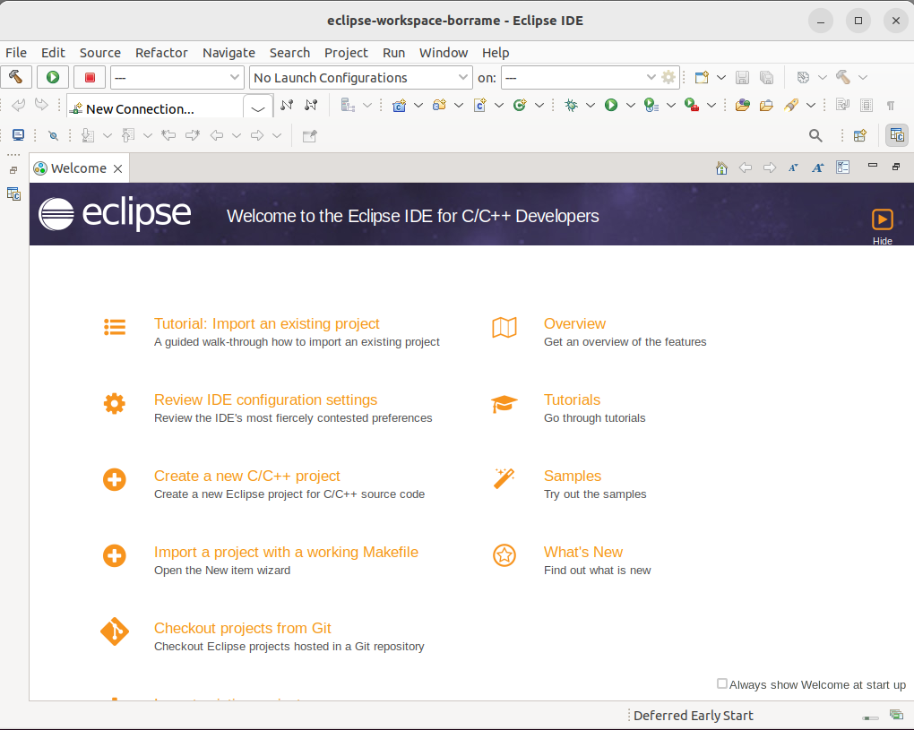
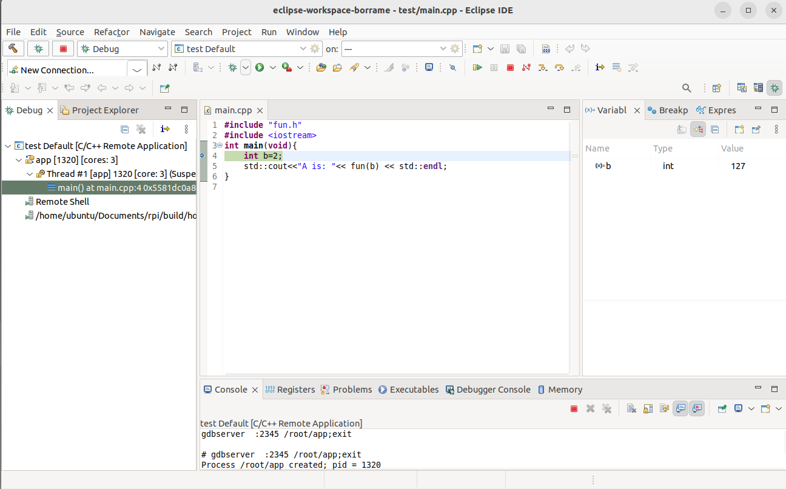
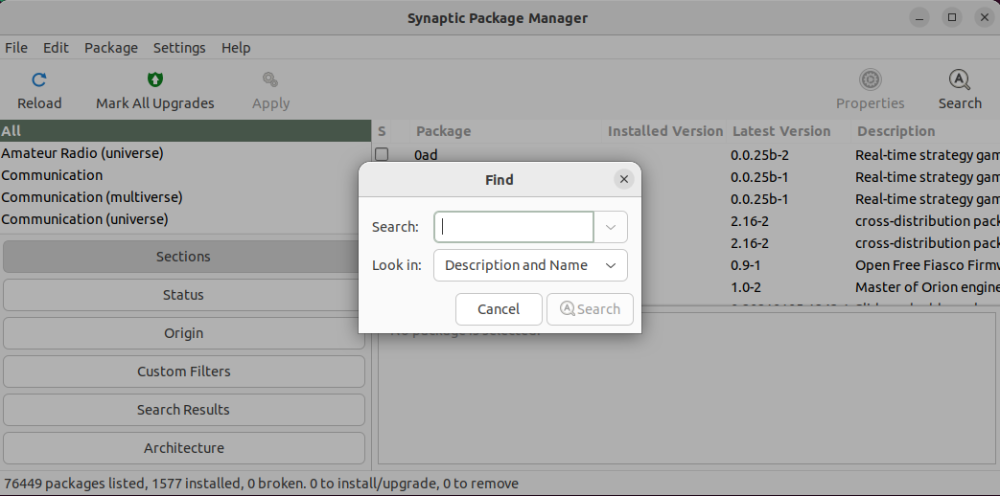

========================================================
Using the integrated development environment Eclipse/CDT
========================================================

Eclipse IDE for C/C++ developers
--------------------------------

The Eclipse IDE CDT is installed in the virtual machine. You can execute
it running eclipse in a window terminal.

Cross-Compiling applications using Eclipse
------------------------------------------

How will a program be compiled? Remember that we are developing cross
applications. We are developing and compiling the code in a Linux x86_64
machine, and we are executing it on an ARM architecture (see Fig. 17).

.. image:: rpi-images/media/image21.emf
   :width: 4.98681in
   :height: 2.79236in

Fig. 17: Summary of the different configurations for developing
applications for embedded systems. Figure copied from “Free Electrons”
training materials (http://free-electrons.com/training/)

The first question is where the cross-compiler and other cross-tools are
located. The answer is this: in the folder “build/host/usr/bin”. If you
inspect this folder's content, you can see the entire compiling,
linking, and debugging tools (see Fig. 18). These programs are executed
in your x86_64 computer, but they generate code for the ARM processor.

.. image:: rpi-images/media/image22.png
   :width: 5.90168in
   :height: 3.83333in

Fig. 18: Cross-compiling tools installed in the host computer

In a Terminal window execute the following commands:

::

   $ cd build/host
   $ source environment-setup
   $ eclipse &

The *environment-setup* file contains the code listed below.

::

   cat <<'EOF'
    _           _ _     _                 _
   | |__  _   _(_) | __| |_ __ ___   ___ | |_
   | '_ \| | | | | |/ _` | '__/ _ \ / _ \| __|
   | |_) | |_| | | | (_| | | | (_) | (_) | |_
   |_.__/ \__,_|_|_|\__,_|_|  \___/ \___/ \__|

          Making embedded Linux easy!

   Some tips:
   * PATH now contains the SDK utilities
   * Standard autotools variables (CC, LD, CFLAGS) are exported
   * Kernel compilation variables (ARCH, CROSS_COMPILE, KERNELDIR) are exported
   * To configure do "./configure $CONFIGURE_FLAGS" or use
     the "configure" alias
   * To build CMake-based projects, use the "cmake" alias

   EOF
   if [ x"$BASH_VERSION" != x"" ] ; then
   	SDK_PATH=$(dirname $(realpath "${BASH_SOURCE[0]}"))
   elif [ x"$ZSH_VERSION" != x"" ] ; then
   	SDK_PATH=$(dirname $(realpath $0))
   else
   	echo "unsupported shell"
   fi
   export "AR=aarch64-buildroot-linux-gnu-gcc-ar"
   export "AS=aarch64-buildroot-linux-gnu-as"
   export "LD=aarch64-buildroot-linux-gnu-ld"
   export "NM=aarch64-buildroot-linux-gnu-gcc-nm"
   export "CC=aarch64-buildroot-linux-gnu-gcc"
   export "GCC=aarch64-buildroot-linux-gnu-gcc"
   export "CPP=aarch64-buildroot-linux-gnu-cpp"
   export "CXX=aarch64-buildroot-linux-gnu-g++"
   export "FC=aarch64-buildroot-linux-gnu-gfortran"
   export "F77=aarch64-buildroot-linux-gnu-gfortran"
   export "RANLIB=aarch64-buildroot-linux-gnu-gcc-ranlib"
   export "READELF=aarch64-buildroot-linux-gnu-readelf"
   export "STRIP=aarch64-buildroot-linux-gnu-strip"
   export "OBJCOPY=aarch64-buildroot-linux-gnu-objcopy"
   export "OBJDUMP=aarch64-buildroot-linux-gnu-objdump"
   export "AR_FOR_BUILD=/usr/bin/ar"
   export "AS_FOR_BUILD=/usr/bin/as"
   export "CC_FOR_BUILD=/usr/bin/gcc"
   export "GCC_FOR_BUILD=/usr/bin/gcc"
   export "CXX_FOR_BUILD=/usr/bin/g++"
   export "LD_FOR_BUILD=/usr/bin/ld"
   export "CPPFLAGS_FOR_BUILD=-I$SDK_PATH/include"
   export "CFLAGS_FOR_BUILD=-O2 -I$SDK_PATH/include"
   export "CXXFLAGS_FOR_BUILD=-O2 -I$SDK_PATH/include"
   export "LDFLAGS_FOR_BUILD=-L$SDK_PATH/lib -Wl,-rpath,$SDK_PATH/lib"
   export "FCFLAGS_FOR_BUILD="
   export "DEFAULT_ASSEMBLER=aarch64-buildroot-linux-gnu-as"
   export "DEFAULT_LINKER=aarch64-buildroot-linux-gnu-ld"
   export "CPPFLAGS=-D_LARGEFILE_SOURCE -D_LARGEFILE64_SOURCE -D_FILE_OFFSET_BITS=64"
   export "CFLAGS=-D_LARGEFILE_SOURCE -D_LARGEFILE64_SOURCE -D_FILE_OFFSET_BITS=64  -Os -g0 -D_FORTIFY_SOURCE=1"
   export "CXXFLAGS=-D_LARGEFILE_SOURCE -D_LARGEFILE64_SOURCE -D_FILE_OFFSET_BITS=64  -Os -g0 -D_FORTIFY_SOURCE=1"
   export "LDFLAGS="
   export "FCFLAGS= -Os -g0"
   export "FFLAGS= -Os -g0"
   export "PKG_CONFIG=pkg-config"
   export "STAGING_DIR=$SDK_PATH/aarch64-buildroot-linux-gnu/sysroot"
   export "INTLTOOL_PERL=/usr/bin/perl"
   export "ARCH=arm64"
   export "CROSS_COMPILE=aarch64-buildroot-linux-gnu-"
   export "CONFIGURE_FLAGS=--target=aarch64-buildroot-linux-gnu --host=aarch64-buildroot-linux-gnu --build=x86_64-pc-linux-gnu --prefix=/usr --exec-prefix=/usr --sysconfdir=/etc --localstatedir=/var --program-prefix="
   alias configure="./configure ${CONFIGURE_FLAGS}"
   alias cmake="cmake -DCMAKE_TOOLCHAIN_FILE=$SDK_PATH/share/buildroot/toolchainfile.cmake -DCMAKE_INSTALL_PREFIX=/usr"
   export "PATH=$SDK_PATH/bin:$SDK_PATH/sbin:$PATH"
   export "KERNELDIR=/home/ubuntu/Documents/rpi/build/build/linux-custom/"

This script when is source in a terminal window sets all the environment
variables needed to use the cross-compilation tools and add the folder
of cross-tools to the PATH linux variable.

The execution of eclipse popups a window inviting you to enter the
workspace (see Fig. 19). The workspace is the folder that contain
eclipse projects created by the user. You can have as many workspaces as
you want. Please specify a folder in your account.

+-------+--------------------------------------------------------------+
| |ima  | **[Help]:** The figures displayed in the following           |
| ge16| | paragraphs can be different depending on the Eclipse version |
|       | installed.                                                   |
+=======+==============================================================+
+-------+--------------------------------------------------------------+

.. image:: rpi-images/media/image23.png
   :width: 5.19182in
   :height: 2.66458in

Fig. 19: Selection of the workspace for Eclipse. Use a folder in your
account.

Select Ok, and the welcome window of Eclipse will be shown (Fig. 20).
Next, close the welcome window and the main eclipse window will be
displayed (Fig. 21).

Fig. 20: Eclipse welcome window.

.. image:: rpi-images/media/image25.png
   :width: 5.78753in
   :height: 4.35417in

Fig. 21: Eclipse main window.

In a terminal window create an empty folder. In this folder create the
following files with the content described in the Table 2. The Makefile
uses the environment variables that are defined in the environment where
the makefile is run.

+----------------+-----------------------------------------------------+
| Filename       | Content                                             |
+================+=====================================================+
| Makefile       | LIBS= -lpthread -lm #Libraries used if needed       |
|                |                                                     |
|                | SRCS= main.cpp func.cpp                             |
|                |                                                     |
|                | BIN=app                                             |
|                |                                                     |
|                | CFLAGS+= -g -O0                                     |
|                |                                                     |
|                | OBJS=$(subst .cpp,.o,$(SRCS))                       |
|                |                                                     |
|                | all : $(BIN)                                        |
|                |                                                     |
|                | $(BIN): $(OBJS)                                     |
|                |                                                     |
|                | @echo [link] $@                                     |
|                |                                                     |
|                | $(CXX) -o $@ $(OBJS) $(LDFLAGS) $(LIBS)             |
|                |                                                     |
|                | %.o: %.cpp                                          |
|                |                                                     |
|                | @echo [Compile] $<                                  |
|                |                                                     |
|                | $(CXX) -c $(CFLAGS) $< -o $@                        |
|                |                                                     |
|                | clean:                                              |
|                |                                                     |
|                | @rm -f $(OBJS) $(BIN)                               |
+----------------+-----------------------------------------------------+
| main.cpp       | #include "func.h"                                   |
|                |                                                     |
|                | #include <iostream>                                 |
|                |                                                     |
|                | int main(void){                                     |
|                |                                                     |
|                | int b=2;                                            |
|                |                                                     |
|                | std::cout<<"A is: "<< fun(b) << std::endl;          |
|                |                                                     |
|                | }                                                   |
+----------------+-----------------------------------------------------+
| func.h         | #ifndef \__FUNC_H                                   |
|                |                                                     |
|                | #define \__FUNC_H                                   |
|                |                                                     |
|                | int fun(int);                                       |
|                |                                                     |
|                | #endif                                              |
+----------------+-----------------------------------------------------+
| func.cpp       | int fun(int b){                                     |
|                |                                                     |
|                | int a=b*2;                                          |
|                |                                                     |
|                | return a;                                           |
|                |                                                     |
|                | }                                                   |
+----------------+-----------------------------------------------------+

In Eclipse select in the left part of the windows Import *projects*. A
new window is popup, select then *C/C++* and the option *Existing Code
as Makefile Project*. The window shown in Fig. 22 is displayed. Complete
the name of the project, select the folder with the code and check
*Cross GCC in Toolchain for Indexer Settings*.

.. image:: rpi-images/media/image26.png
   :width: 4.45148in
   :height: 4.95833in

Fig. 22: Selecting the code.

Building a project
------------------

Once you have configured the cross-chain in Eclipse you can build your
project using Project->Build Project. If everything is correct, you will
see the eclipse project as represented in Fig. 29. You can clean the
project (remove the executable and objects) with *Clean*.

.. image:: rpi-images/media/image27.png
   :alt: A screenshot of a computer Description automatically generated
   :width: 6.69375in
   :height: 4.17014in

Fig. 23: Eclipse project compiled (Binaries has been generated)

+-------+--------------------------------------------------------------+
| |ima  | **[Console in Eclipse]:** Have a look at the messages        |
| ge17| | displayed in the Console. You will see how eclipse is        |
|       | calling the cross compiler with different parameters.        |
+=======+==============================================================+
+-------+--------------------------------------------------------------+

Moving the binary to the target
-------------------------------

In order to copy the executable to the target, you have different
options. You can use the Linux application called “scp” or other similar
applications. In our case, we are going to use the “Other Locations….”
utility included in the nautilus explorer. Specify in Server Address
ssh://<ip address>

.. image:: rpi-images/media/image28.png
   :width: 5.57399in
   :height: 2.93365in

Fig. 24: “Connect to Server” option in Nautilus explorer

Executing the application
-------------------------

You can run the Raspberry PI program using putty (remember that once you
have a network connection available in the RPI you can also use putty to
connect to it).

.. image:: rpi-images/media/image29.png
   :alt: A screenshot of a computer Description automatically generated
   :width: 4.45in
   :height: 2.90434in

Fig. 25: Run test program in Raspberry Pi

+-------+--------------------------------------------------------------+
| |ima  | Warning. If you experiment problems using ssh, delete the    |
| ge18| | .ssh folder in your home directory.                          |
+=======+==============================================================+
+-------+--------------------------------------------------------------+

Automatic debugging using gdb and gdbserver
-------------------------------------------

You can directly debug the program running in the RPI using Eclipse.
There are two methods to do it: manually and automatically. In the
manual method, firstly, you need to copy the executable program to the
RPI, change the file permissions to “executable” and execute the program
to be debugged using *gdbserver* utility. Of course, this is a
time-consuming process and very inefficient. The alternative solution is
to use automatic debugging. In order to debug your applications, we need
to define a debug session and configure it. Firstly, *Select Run->Debug
Configurations* and generate a new configuration under *C/C++ Remote
Application*. You need to complete the different tabs available in this
window. The first one is the main tab (see Fig. 33). You need to
configure here the path to the C/C++ application to be debugged, the
project name, the connection with the target (you will need to create a
new one using the IP address of your RPI), the remote path where your
executable file will be downloaded, and the mode for the debugging
(Automatic Remote Debugging Launcher). Secondly, in the argument tab,
you can specify the arguments of your executable program. It is very
important here that you can also specify the working directory path
where the executable will be copied and launched (you need to have
rights in this folder).

.. image:: rpi-images/media/image30.png
   :alt: A screenshot of a computer Description automatically generated
   :width: 6.69375in
   :height: 3.94931in

Fig. 26: Creating a Debug Configuration

In the debugger window you need to configure the path of your cross gdb
application. Remember that we are working with a cross-compiler, cross
debugging. Therefore, you need to provide here the correct path of your
gdb. The GDB command file (.gdbinit) must be specified, providing a path
with an empty file. In the Gdbserver settings tab, you need to provide
the path to the gdbserver in the target and the TCP/IP port used (by
default 2345).

.. image:: rpi-images/media/image30.png
   :alt: A screenshot of a computer Description automatically generated
   :width: 6.03905in
   :height: 3.56303in

Fig. 27: Debug configuration, including the path to locate the cross gdb
tool.

Now, press Debug in Eclipse window, and you can debug your application
remotely.

Fig. 28: Debugging session on the RPI remotely

Preparing the linux virtual machine.
====================================

Download VMware Workstation Player.
-----------------------------------

The link https://www.vmware.com/support/pubs/player_pubs.html contains
documentation describing the installation and basic use of VMware
Workstation Player. Follow the instructions to set up the application on
your computer.

Installing Ubuntu 22.04 LTS as a virtual machine.
-------------------------------------------------

+-------+--------------------------------------------------------------+
| |ima  | **[Ubuntu version]:** It is mandatory to install Ubuntu      |
| ge19| | 22.04 version.                                               |
+=======+==============================================================+
+-------+--------------------------------------------------------------+

The first step is to download Ubuntu 22.04.3 (64 bit PC) from Ubuntu web
site using this link: http://releases.ubuntu.com/ . You will download an
ISO image with this Linux operating System.Run WMware player and install
Ubuntu using the VMWare player instructions. Consider the following when
creating the virtual machine: you need at least 150Gbytes of hard disk
space (in multiple files), 3GByte of RAM, and, if possible 4 processors.
The installation time will be half an hour, more or less, depending on
your computer. Moving a virtual machine from one computer to another is
a time-consuming task; therefore, take this into account to minimize the
development time.

Installing synaptic
-------------------

If you need to install software packages, you can do it using the linux
terminal command apt-get. Another alternative process is the use of the
synaptic utility. In order to use it, you need to install it using this
command:

::

   $ sudo apt-get install synaptic

Once installed, you can search and execute the synaptic program. When
you click two times over the package, it will show all the dependent
packages that would be installed.

Fig. 30: Synaptic window

Installing putty
----------------

You need to execute:

-  sudo apt-get install putty

Installing packages for supporting Buildroot.
---------------------------------------------

Using buildroot requires some software packages that have to be
installed in the VM. These are listed in this link
http://buildroot.uclibc.org/downloads/manual/manual.html#requirement.
You need to install at least:

-  g++

-  git

Installing packages supporting Eclipse
--------------------------------------

You need to install:

-  eclipse-cdt (eclipse C/C++ programming)

-  eclipse-rse (eclipse remote explorer)

-  eclipse-cdt-launch-remote (eclipse for remote debugging)

.. |image1| image:: rpi-images/media/image2.png
   :width: 0.91667in
   :height: 0.32292in

.. |image10| image:: rpi-images/media/image16.emf

