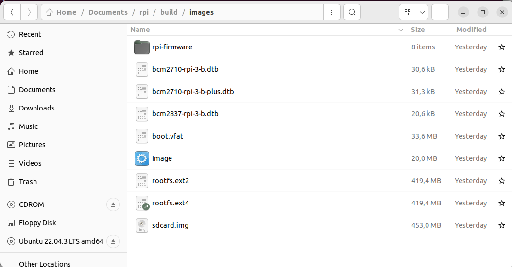

Building linux using buildroot
==============================

Elements needed for the execution of these LABS
-----------------------------------------------

In order to execute this lab properly, you need the following elements:

1. The VMware player software version 16.0 or above. Available at
   `www.wmware.com <http://www.wmware.com>`__ (free download and use).
   This software has already been installed on the laboratory desktop
   computer.

2. A VMWare virtual machine with Ubuntu 22.04 and all the software
   packages installed is already available on the Desktop. This virtual
   machine is available for your personal use. If you want to set up
   your virtual machine by yourself, follow the instructions provided in
   `Annex I <#_annex_i:_Ubuntu>`__.

3. A Raspberry Pi, accessories and a USB cable are available at the
   laboratory.

4. Basic knowledge of Linux commands.

Starting the VMware
-------------------

Start VMware Player and open the RPI Virtual Machine. Wait until the
welcome screen is displayed (see Fig. 1 and Fig. 2). Login as
“\ *ubuntu”* user using the password “ubuntu”.

.. image:: rpi-images/media/image4.png
   :alt: A screenshot of a computer Description automatically generated
   :width: 4.92027in
   :height: 3.97031in

Fig. 1: Main screen of VMware player with some VM available to be
executed.

Fig. 2: Ubuntu Virtual Machine login screen.

Open the **Firefox** web browser and download from
https://buildroot.org/, the version identified as **buidlroot2023-08-3**
(use the download link, see Fig. 3, and navigate searching for earlier
releases if necessary, https://buildroot.org/downloads/ ). Save the file
to the **Documents** folder in your account (Fig. 4).

.. image:: rpi-images/media/image6.png
   :width: 5.97015in
   :height: 4.03801in

Fig. 3 Buildroot home page.

Buildroot is a tool to generate embedded Linux systems in our PC, and
then this Linux will be installed in the target.

.. image:: rpi-images/media/image7.png
   :width: 5.25472in
   :height: 3.28499in

Fig. 4: Example of Downloading buildroot source code.

Create a folder “rpi” in “Documentes”. Copy the file to the
“Documents/rpi” folder and decompress the file (Fig. 5).

.. image:: rpi-images/media/image8.png
   :alt: A screenshot of a computer Description automatically generated
   :width: 6.69375in
   :height: 3.43958in

Fig. 5: Buildroot folder (the folder name depends on the version
downloaded).

Right-click in the window and execute “Open in Terminal” or execute the
Terminal application from Dash home as shown in Fig. 6 (if “Open in
Terminal” is not available, search how to install it in Ubuntu).

.. image:: rpi-images/media/image9.png
   :width: 4.20139in
   :height: 3.25347in

Fig. 6: Dash home, Terminal application

In some seconds, a command window is displayed. Then, execute these
commands:

+-------+--------------------------------------------------------------+
| |im   | **[Help]:** For this course, you will need to become         |
| age3| | familiar with the Linux Terminal use. On the Moodle site of  |
|       | this course, you can find a cheat sheet with the basic Linux |
|       | commands.                                                    |
+=======+==============================================================+
+-------+--------------------------------------------------------------+

+-------+--------------------------------------------------------------+
| |im   | **[Help]:** In a Linux terminal, the “TAB” key helps you to  |
| age4| | autocomplete the commands, folders, and file names. You can  |
|       | find a description of “make” application at this link        |
|       | https://www.gnu.org/software/make/manual/make.pdf            |
+=======+==============================================================+
+-------+--------------------------------------------------------------+

In some seconds, you will see a new window similar to Fig. 7.

.. image:: rpi-images/media/image10.png
   :alt: A screenshot of a computer Description automatically generated
   :width: 6.69375in
   :height: 3.20208in

Fig. 7: Buildroot setup screen.

Configuring Buildroot for RPI3.
-------------------------------

Once the **Buildroot** configuration is started, it is necessary to
configure the different items. You need to navigate the different menus
and select the installation elements. Table I contains the specific
configuration of **Buildroot** for installing it in the Raspberry Pi.
Depending on the downloaded version, the organization and the items
displayed can differ. If an item of buildroot configuration does not
appear in the Table I leaves it with its default value.

+-------+--------------------------------------------------------------+
| |im   | **[Help]:** The Buildroot configuration is an iterative      |
| age5| | process. In order to set up your embedded Linux system, you  |
|       | will need to execute the configuration several times.        |
+=======+==============================================================+
+-------+--------------------------------------------------------------+

+---------+-------------+-------------------------+-------------------+
| **Main  | **Subitem** | **Value**               | **Comments**      |
| Item**  |             |                         |                   |
+=========+=============+=========================+===================+
| **T     | Target      | AArch64 (little endian) | ARM 64 bits       |
| arget** | A           |                         |                   |
| options | rchitecture |                         |                   |
+---------+-------------+-------------------------+-------------------+
|         | Target      | Cortex-A53              |                   |
|         | A           |                         |                   |
|         | rchitecture |                         |                   |
|         | Variant     |                         |                   |
+---------+-------------+-------------------------+-------------------+
|         | Flo         | VFPv4                   |                   |
|         | ating-point |                         |                   |
|         | strategy    |                         |                   |
+---------+-------------+-------------------------+-------------------+
|         | MMU Page    | 4kB                     |                   |
|         | Size        |                         |                   |
+---------+-------------+-------------------------+-------------------+
|         | Target      | elf                     |                   |
|         | Binary      |                         |                   |
|         | Format      |                         |                   |
+---------+-------------+-------------------------+-------------------+
|         |             |                         |                   |
+---------+-------------+-------------------------+-------------------+
| **Tool  |             |                         | Cross Compiler,   |
| chain** |             |                         | linker, and       |
|         |             |                         | libraries to be   |
|         |             |                         | built to compile  |
|         |             |                         | our embedded      |
|         |             |                         | application       |
+---------+-------------+-------------------------+-------------------+
|         | Toolchain   | Buildroot toolchain     | The Embedded      |
|         | Type        |                         | system will be    |
|         |             |                         | compiled with     |
|         |             |                         | tools integrated  |
|         |             |                         | into Buildroot    |
+---------+-------------+-------------------------+-------------------+
|         | Custom      | buidlroot               |                   |
|         | toolchain   |                         |                   |
|         | vendor name |                         |                   |
+---------+-------------+-------------------------+-------------------+
|         | C library   | glibc                   | Library           |
|         |             |                         | containing the    |
|         |             |                         | typical C         |
|         |             |                         | libraries used in |
|         |             |                         | Linux             |
|         |             |                         | environments      |
|         |             |                         | (stdlib, stdio,   |
|         |             |                         | etc)              |
+---------+-------------+-------------------------+-------------------+
|         | Kernel      | Same as kernel being    |                   |
|         | Headers     | built                   |                   |
+---------+-------------+-------------------------+-------------------+
|         | Custom      | 5.10.x                  |                   |
|         | Kernel      |                         |                   |
|         | Headers     |                         |                   |
|         | Series      |                         |                   |
+---------+-------------+-------------------------+-------------------+
|         | Binutils    | binutils 2.40           | Binutils contains |
|         | Version     |                         | tools to manage   |
|         |             |                         | the binary files  |
|         |             |                         | obtained in the   |
|         |             |                         | compilation of    |
|         |             |                         | the different     |
|         |             |                         | applications      |
+---------+-------------+-------------------------+-------------------+
|         | GCC         | gcc 12.x                | GCC tools version |
|         | compiler    |                         | to be installed   |
|         | Version     |                         |                   |
+---------+-------------+-------------------------+-------------------+
|         | Enable C++  | Yes                     | Including support |
|         | support     |                         | for C++           |
|         |             |                         | programming,      |
|         |             |                         | compiling, and    |
|         |             |                         | linking.          |
+---------+-------------+-------------------------+-------------------+
|         | Build cross | yes                     | Includes the      |
|         | gdb for the |                         | support for GDB.  |
|         | host        | Add Python support      | GCC debugger.     |
+---------+-------------+-------------------------+-------------------+
|         | GDB         | Gdb 11.x                |                   |
|         | debugger    |                         |                   |
|         | version     |                         |                   |
+---------+-------------+-------------------------+-------------------+
| **Build |             | Default values          | How Buildroot     |
| op      |             |                         | will build the    |
| tions** |             |                         | code. Leave       |
|         |             |                         | default values.   |
+---------+-------------+-------------------------+-------------------+
| *       |             |                         |                   |
| *System |             |                         |                   |
| C       |             |                         |                   |
| onfigur |             |                         |                   |
| ation** |             |                         |                   |
+---------+-------------+-------------------------+-------------------+
|         | Root        | Default target skeleton | Linux folder      |
|         | filesystem  |                         | organization for  |
|         | skeleton    |                         | the embedded      |
|         |             |                         | system            |
+---------+-------------+-------------------------+-------------------+
|         | System      | **buildroot**           | Name of the       |
|         | Hostname    |                         | embedded system   |
+---------+-------------+-------------------------+-------------------+
|         | System      | **Linux RPI 3**         | Banner            |
|         | Banner      |                         |                   |
+---------+-------------+-------------------------+-------------------+
|         | Passwords   | sha-256                 |                   |
|         | encoding    |                         |                   |
+---------+-------------+-------------------------+-------------------+
|         | Init System | Busybox                 |                   |
+---------+-------------+-------------------------+-------------------+
|         | /dev        | Dynamic using devtmpfs  |                   |
|         | management  | + mdev                  |                   |
+---------+-------------+-------------------------+-------------------+
|         | Path to     | **sy                    | Text files with   |
|         | permissions | stem/device_table.txt** | permissions for   |
|         | table       |                         | /dev files        |
+---------+-------------+-------------------------+-------------------+
|         | Enable root | Yes                     |                   |
|         | login with  |                         |                   |
|         | password    |                         |                   |
+---------+-------------+-------------------------+-------------------+
|         | Root        | **rpi**                 |                   |
|         | password    |                         |                   |
+---------+-------------+-------------------------+-------------------+
|         | /bin/sh     | Busybox’ default shell  |                   |
+---------+-------------+-------------------------+-------------------+
|         | Run a       | **tty PORT: console**   | Linux device file |
|         | getty: Port |                         | with the port to  |
|         | to run a    | **Keep kernel default** | run getty (login) |
|         | getty       |                         | process.          |
|         |             | **vt100**               |                   |
+---------+-------------+-------------------------+-------------------+
|         | remount     | Yes                     |                   |
|         | root        |                         |                   |
|         | filesystem  |                         |                   |
|         | read-write  |                         |                   |
|         | during boot |                         |                   |
+---------+-------------+-------------------------+-------------------+
|         | Network     | eth0                    |                   |
|         | interface   |                         |                   |
|         | to          |                         |                   |
|         | configure   |                         |                   |
|         | trough DHCP |                         |                   |
+---------+-------------+-------------------------+-------------------+
|         | Set the     | /bin:/                  |                   |
|         | system's    | sbin:/usr/bin:/usr/sbin |                   |
|         | default     |                         |                   |
|         | PATH        |                         |                   |
+---------+-------------+-------------------------+-------------------+
|         | Purge       | Yes                     |                   |
|         | unwanted    |                         |                   |
|         | locales     |                         |                   |
+---------+-------------+-------------------------+-------------------+
|         | Custom      | <path_to_               | 
/board/raspbe | ath_to_buidlroot> |
|         | run before  | rrypi3-64/post-build.sh | path where        |
|         | creating    |                         | buildroot source  |
|         | filesystem  |                         | is                |
|         | images      |                         |                   |
+---------+-------------+-------------------------+-------------------+
|         | Custom      |                         |                   |
|         | scripts to  |                         |                   |
|         | run inside  |                         |                   |
|         | the         |                         |                   |
|         | fakeroot    |                         |                   |
|         | environment |                         |                   |
+---------+-------------+-------------------------+-------------------+
|         | Custom      | <path_to_               |                   |
|         | scripts to  | buidlroot>/board/raspbe |                   |
|         | run after   | rrypi3-64/post-image.sh |                   |
|         | creating    |                         |                   |
|         | filesystem  |                         |                   |
|         | images      |                         |                   |
+---------+-------------+-------------------------+-------------------+
| **Linux |             |                         |                   |
| K       |             |                         |                   |
| ernel** |             |                         |                   |
+---------+-------------+-------------------------+-------------------+
|         | Kernel      | **Custom tarball**      |                   |
|         | Version     |                         |                   |
+---------+-------------+-------------------------+-------------------+
|         | URL of      | **$(call                |                   |
|         | custom      | github,                 |                   |
|         | kernel      | raspberrypi,linux,0b54d |                   |
|         | tarball     | bda3cca2beb51e236a25738 |                   |
|         |             | 784e90853b64)/linux-0b5 |                   |
|         |             | 4dbda3cca2beb51e236a257 |                   |
|         |             | 38784e90853b64.tar.gz** |                   |
+---------+-------------+-------------------------+-------------------+
|         | Kernel      | Using and in-tree       |                   |
|         | co          | defconfig file          |                   |
|         | nfiguration |                         |                   |
+---------+-------------+-------------------------+-------------------+
|         | Defconfig   | **bcmrpi3**             |                   |
|         | name        |                         |                   |
+---------+-------------+-------------------------+-------------------+
|         | Kernel      | Image                   |                   |
|         | binary      |                         |                   |
|         | format      |                         |                   |
+---------+-------------+-------------------------+-------------------+
|         | Kernel      | Gzip compression        |                   |
|         | compression |                         |                   |
|         | format      |                         |                   |
+---------+-------------+-------------------------+-------------------+
|         | Build a     | yes                     |                   |
|         | Device Tree |                         |                   |
|         | Blob (DTB)  |                         |                   |
+---------+-------------+-------------------------+-------------------+
|         | In-tree     | b                       |                   |
|         | Device Tree | roadcom/bcm2710-rpi-3-b |                   |
|         | Source file | broadc                  |                   |
|         | names       | om/bcm2710-rpi-3-b-plus |                   |
|         |             | b                       |                   |
|         |             | roadcom/bcm2837-rpi-3-b |                   |
+---------+-------------+-------------------------+-------------------+
|         | Need host   | Yes                     |                   |
|         | OpenSSL     |                         |                   |
+---------+-------------+-------------------------+-------------------+
|         | Linux       | Nothing                 |                   |
|         | Kernel      |                         |                   |
|         | Extensions  |                         |                   |
+---------+-------------+-------------------------+-------------------+
|         | Linux       | Nothing                 |                   |
|         | Kernel      |                         |                   |
|         | Tools       |                         |                   |
+---------+-------------+-------------------------+-------------------+
| *       |             |                         |                   |
| *Target |             |                         |                   |
| Pac     |             |                         |                   |
| kages** |             |                         |                   |
+---------+-------------+-------------------------+-------------------+
|         | Busybox     | yes                     |                   |
+---------+-------------+-------------------------+-------------------+
|         | Busybox     | **package/b             |                   |
|         | co          | usybox/busybox.config** |                   |
|         | nfiguration |                         |                   |
|         | file to use |                         |                   |
+---------+-------------+-------------------------+-------------------+
|         | Audio and   | Default values          |                   |
|         | video       |                         |                   |
|         | a           |                         |                   |
|         | pplications |                         |                   |
+---------+-------------+-------------------------+-------------------+
|         | C           | Default values          |                   |
|         | ompresssors |                         |                   |
|         | and         |                         |                   |
|         | de          |                         |                   |
|         | compressors |                         |                   |
+---------+-------------+-------------------------+-------------------+
|         | Debugging,  | **gdb, gdbserver**      |                   |
|         | profiling   |                         |                   |
|         | and         |                         |                   |
|         | benchmark   |                         |                   |
+---------+-------------+-------------------------+-------------------+
|         | D           | Default values          |                   |
|         | evelopments |                         |                   |
|         | tools       |                         |                   |
+---------+-------------+-------------------------+-------------------+
|         | Filesystem  | Default values          |                   |
|         | and flash   |                         |                   |
|         | utilities   |                         |                   |
+---------+-------------+-------------------------+-------------------+
|         | Games       | Default values          |                   |
+---------+-------------+-------------------------+-------------------+
|         | Graphic     | Default values          |                   |
|         | libraries   |                         |                   |
|         | and         |                         |                   |
|         | a           |                         |                   |
|         | pplications |                         |                   |
|         | (gr         |                         |                   |
|         | aphic/text) |                         |                   |
+---------+-------------+-------------------------+-------------------+
|         | Hardware    | **F                     |                   |
|         | handling    | irmware->rpi-firmware** |                   |
|         |             |                         |                   |
|         |             | **rpi 0/1/2/3           |                   |
|         |             | (bootcode.bin, Default, |                   |
|         |             | Extended)**             |                   |
|         |             |                         |                   |
|         |             | **Path to a file stores |                   |
|         |             | as boot/config.txt      |                   |
|         |             | board/raspberrypi3-     |                   |
|         |             | 64/config_3_64bit.txt** |                   |
|         |             |                         |                   |
|         |             | **Path to a file stored |                   |
|         |             | as boot/cmdline.txt     |                   |
|         |             | board/ra                |                   |
|         |             | spberrypi/cmdline.txt** |                   |
|         |             |                         |                   |
|         |             | **install DTB           |                   |
|         |             | overlays**              |                   |
+---------+-------------+-------------------------+-------------------+
|         | I           | Default values          |                   |
|         | nterpreters |                         |                   |
|         | language    |                         |                   |
|         | and         |                         |                   |
|         | scripting   |                         |                   |
+---------+-------------+-------------------------+-------------------+
|         | Libraries   |                         |                   |
+---------+-------------+-------------------------+-------------------+
|         | Mi          | Default                 |                   |
|         | scellaneous |                         |                   |
+---------+-------------+-------------------------+-------------------+
|         | Networking  | **ifupdown scripts**    |                   |
|         | a           |                         |                   |
|         | pplications | **open ssh**            |                   |
+---------+-------------+-------------------------+-------------------+
|         | Package     | Default                 |                   |
|         | managers    |                         |                   |
|         |             |                         |                   |
|         | Real Time   |                         |                   |
|         |             |                         |                   |
|         | Shell and   |                         |                   |
|         | utilities   |                         |                   |
|         |             |                         |                   |
|         | System      |                         |                   |
|         | Tools       |                         |                   |
|         |             |                         |                   |
|         | Text        |                         |                   |
|         | Editors and |                         |                   |
|         | viewers     |                         |                   |
+---------+-------------+-------------------------+-------------------+
| **Fil   |             |                         |                   |
| esystem |             |                         |                   |
| I       |             |                         |                   |
| mages** |             |                         |                   |
+---------+-------------+-------------------------+-------------------+
|         | ext2/3/4    | ext4                    |                   |
|         | root        |                         |                   |
|         | filesystem  | exact size **400M**     |                   |
|         |             |                         |                   |
|         |             | Compression method **no |                   |
|         |             | compression**           |                   |
|         |             |                         |                   |
|         |             | **Remaining values->    |                   |
|         |             | default**               |                   |
+---------+-------------+-------------------------+-------------------+
|         | tar the     | no compression          |                   |
|         | root        |                         |                   |
|         | filesystem  |                         |                   |
+---------+-------------+-------------------------+-------------------+
| **Host  |             |                         |                   |
| util    |             |                         |                   |
| ities** |             |                         |                   |
+---------+-------------+-------------------------+-------------------+
|         | host        | Yes                     |                   |
|         | genimage    |                         |                   |
+---------+-------------+-------------------------+-------------------+
|         | host        | Yes                     |                   |
|         | dosfstools  |                         |                   |
+---------+-------------+-------------------------+-------------------+
|         | host mtools | Yes                     |                   |
+---------+-------------+-------------------------+-------------------+
|         | Host        | Yes                     |                   |
|         | enviro      |                         |                   |
|         | nment-setup |                         |                   |
+---------+-------------+-------------------------+-------------------+
| *       |             | Default values          |                   |
| *Legacy |             |                         |                   |
| config  |             |                         |                   |
| op      |             |                         |                   |
| tions** |             |                         |                   |
+---------+-------------+-------------------------+-------------------+

Once you have configured all the menus, you need to exit, saving the
values (File->Quit).

+-------+--------------------------------------------------------------+
| |im   | **[Help]:** The **Buildroot** configuration is stored in a   |
| age6| | file named “.config”. You should have a backup of this file. |
+=======+==============================================================+
+-------+--------------------------------------------------------------+

Compiling buildroot
-------------------

In the Terminal Window executes the following command:

If everything is correct, you will see a final window similar to the one
represented in Fig. 8.

+-------+--------------------------------------------------------------+
| |im   | **[Time for this step]:** In this step, buildroot will       |
| age7| | connect, using the internet, to different repositories.      |
|       | After downloading the code, Buildroot will compile the       |
|       | applications and generate a lot of files and folders.        |
|       | Depending on your internet speed access and the              |
|       | configuration chosen, this step could take up to **one hour  |
|       | and a half**.                                                |
+=======+==============================================================+
+-------+--------------------------------------------------------------+

+-------+--------------------------------------------------------------+
| |im   | Warning. If you have errors in the buildroot configuration,  |
| age8| | you could obtain errors in this compilation phase. Check     |
|       | your configuration correctly. Use “make clean” to clean up   |
|       | your partial compilation.                                    |
+=======+==============================================================+
+-------+--------------------------------------------------------------+

+-------+--------------------------------------------------------------+
| |im   | Warning. dl subfolder in your buildroot folder contains all  |
| age9| | the packages downloaded for the internet. If you want to     |
|       | move your buildroot configuration from one computer to       |
|       | another, avoiding the copy of the virtual machine, you can   |
|       | copy this folder.                                            |
+=======+==============================================================+
+-------+--------------------------------------------------------------+

Fig. 8: Successful compilation and installation of Buildroot

**Buildroot** has generated some folders with different files and
subfolders containing the tools for generating your Embedded Linux
System. The next paragraph explains the main outputs obtained,

Buildroot Output.
-----------------

The main output files of the execution of the previous steps can be
located in the folder “./images”. Fig. 9 summarizes the use of
**Buildroot**. Buildroot generates a bootloader, a kernel image, and a
file system.

.. image:: rpi-images/media/image13.emf
   :width: 5.77292in
   :height: 1.81806in

Fig. 9: Schematic representation of the Buildroot tool. Buildroot
generates the root file system, the kernel image, the bootloader, and
the toolchain. Figure copied from “Bootlin” training materials
(`http://bootlin.com/training/ <http://bootlins.com/training/>`__)

In our specific case, the folder content is shown in Fig. 10

Fig. 10: The images folder contains the binary files for our embedded
system.

Copy the sdcard.img file to your SDcard using this Linux command in the
Buildroot folder (sdb is typically the device assigned to the sdcard,
unless you have other removable devices connected to the system):

::

   $ sudo dd if=./images/sdcard.img of=/dev/sd<x> bs=10M //<x> is the identification used by Linux for your microSD card, tipically “b” or “c”, never use “a” because this is the operating system hardisk

Remember to format again the microSDcard if you need to repeat this
process (linux gparted is an excellent tool to partition and format the
SD card).

